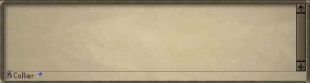

# Collection Log Command

A [Runelite](https://github.com/runelite/runelite) plugin to display collection log data using a chat command.

## Usage
Either type `!log` to display the total unique items obtained or `!log page name` where page name is the name of the collection page.

The command will try to alias common ways to refer to a piece of content to the correct page, but the full page name will also work.

- `!log cox` -> Chambers of Xeric
- `!log wt` -> Wintertodt
- `!log ba` -> Barbarian Assault
- `!log rooftop` -> Rooftop Agility
- `!log pets` -> All Pets

The collection log data is pulled from [collectionlog.net](https://collectionlog.net). In order for your account to have accurate data install the [Collection Log Plugin](https://github.com/evansloan/collection-log) and enable the upload feature.